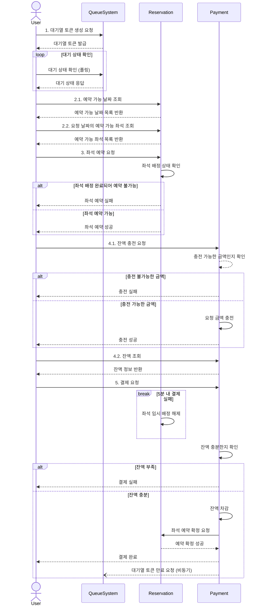

## 콘서트 예약 서비스 Sequence Diagram

```mermaid
sequenceDiagram
    actor User
    participant QueueSystem
    participant Reservation
    participant Payment
    User->>QueueSystem: 1. 대기열 토큰 생성 요청
    QueueSystem-->>User: 대기열 토큰 발급
    
    loop 대기 상태 확인
        User->>QueueSystem: 대기 상태 확인 (폴링)
        QueueSystem-->>User: 대기 상태 응답
    end
    
    User->>Reservation: 2.1. 예약 가능 날짜 조회
    Reservation-->>User: 예약 가능 날짜 목록 반환
    
    User->>Reservation: 2.2. 요청 날짜의 예약 가능 좌석 조회
    Reservation-->>User: 예약 가능 좌석 목록 반환
    
    User->>Reservation: 3. 좌석 예약 요청
    Reservation->>Reservation: 좌석 배정 상태 확인
    alt 좌석 배정 완료되어 예약 불가능
        Reservation-->>User: 좌석 예약 실패
    else 좌석 예약 가능
        Reservation-->>User: 좌석 예약 성공
    end
    
    User->>Payment: 4.1. 잔액 충전 요청
    Payment-->>Payment: 충전 가능한 금액인지 확인
    alt 충전 불가능한 금액
        Payment-->>User: 충전 실패
    else 충전 가능한 금액
        Payment->>Payment: 요청 금액 충전
        Payment-->>User: 충전 성공
    end
    
    User->>Payment: 4.2. 잔액 조회
    Payment-->>User: 잔액 정보 반환
    
    User->>Payment: 5. 결제 요청
    break 5분 내 결제 실패
    Reservation->>Reservation: 좌석 임시 배정 해제
    end

    Payment->>Payment: 잔액 충분한지 확인
    alt 잔액 부족
        Payment-->>User: 결제 실패
    else 잔액 충분
        Payment->>Payment: 잔액 차감
        Payment->>Reservation: 좌석 예약 확정 요청
        Reservation-->>Payment: 예약 확정 성공
        Payment-->>User: 결제 완료
        Payment--)QueueSystem: 대기열 토큰 만료 요청 (비동기)
    end
```
