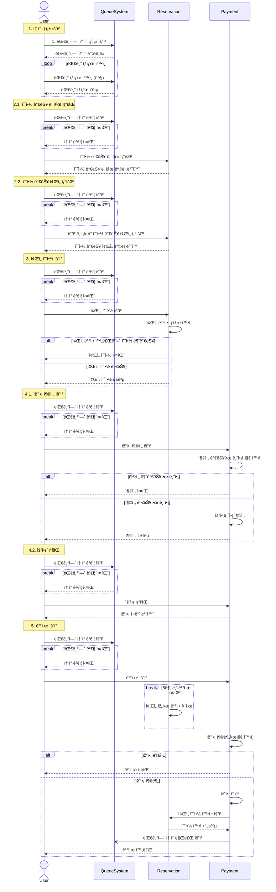

## 😺 콘서트 예약 서비스 Sequence Diagram

```mermaid
sequenceDiagram
    actor User
    participant QueueSystem
    participant Reservation
    participant Payment
    note over User: 1. í† í° ìƒì„± 요청
    User->>QueueSystem: 1. 대기열 í† í° ìƒì„± 요청
    QueueSystem-->>User: 대기열 í† í° ë°œê¸‰
    
    loop 대기 ìƒíƒœ 확ì¸
        User->>QueueSystem: 대기 ìƒíƒœ í™•ì¸ (í´ë§)
        QueueSystem-->>User: 대기 ìƒíƒœ ì‘답
    end

    note over User: 2.1. 예약 가능 날짜 조회
    User->>QueueSystem: 대기열 í† í° ê²€ì¦ ìš”ì²­
    break 대기열 ê²€ì¦ ì‹¤íŒ¨
        QueueSystem-->>User: í† í° ê²€ì¦ ì‹¤íŒ¨
    end
    
    User->>Reservation: 예약 가능 날짜 조회
    Reservation-->>User: 예약 가능 날짜 ëª©ë¡ ë°˜í™˜

    note over User: 2.2. 예약 가능 ì¢Œì„ ì¡°íšŒ
    User->>QueueSystem: 대기열 í† í° ê²€ì¦ ìš”ì²­
    break 대기열 ê²€ì¦ ì‹¤íŒ¨
        QueueSystem-->>User: í† í° ê²€ì¦ ì‹¤íŒ¨
    end
    
    User->>Reservation: 요청 ë‚ ì§œì˜ ì˜ˆì•½ 가능 ì¢Œì„ ì¡°íšŒ
    Reservation-->>User: 예약 가능 ì¢Œì„ ëª©ë¡ ë°˜í™˜

    note over User: 3. ì¢Œì„ ì˜ˆì•½ 요청
    User->>QueueSystem: 대기열 í† í° ê²€ì¦ ìš”ì²­
    break 대기열 ê²€ì¦ ì‹¤íŒ¨
        QueueSystem-->>User: í† í° ê²€ì¦ ì‹¤íŒ¨
    end
    
    User->>Reservation: ì¢Œì„ ì˜ˆì•½ 요청
    Reservation->>Reservation: ì¢Œì„ ë°°ì • ìƒíƒœ 확ì¸
    alt ì¢Œì„ ë°°ì • 완료ë˜ì–´ 예약 불가능
        Reservation-->>User: ì¢Œì„ ì˜ˆì•½ 실패
    else ì¢Œì„ ì˜ˆì•½ 가능
        Reservation-->>User: ì¢Œì„ ì˜ˆì•½ 성공
    end

    note over User: 4.1. 잔액 충전 요청
    User->>QueueSystem: 대기열 í† í° ê²€ì¦ ìš”ì²­
    break 대기열 ê²€ì¦ ì‹¤íŒ¨
        QueueSystem-->>User: í† í° ê²€ì¦ ì‹¤íŒ¨
    end
    
    User->>Payment: 잔액 충전 요청
    Payment-->>Payment: 충전 가능한 금액ì¸ì§€ 확ì¸
    alt 충전 불가능한 금액
        Payment-->>User: 충전 실패
    else 충전 가능한 금액
        Payment->>Payment: 요청 금액 충전
        Payment-->>User: 충전 성공
    end

    note over User: 4.2. 잔액 조회
    User->>QueueSystem: 대기열 í† í° ê²€ì¦ ìš”ì²­
    break 대기열 ê²€ì¦ ì‹¤íŒ¨
        QueueSystem-->>User: í† í° ê²€ì¦ ì‹¤íŒ¨
    end
    
    User->>Payment: 잔액 조회
    Payment-->>User: 잔액 정보 반환

    note over User: 5. 결제 요청
    User->>QueueSystem: 대기열 í† í° ê²€ì¦ ìš”ì²­
    break 대기열 ê²€ì¦ ì‹¤íŒ¨
        QueueSystem-->>User: í† í° ê²€ì¦ ì‹¤íŒ¨
    end
    
    User->>Payment: 결제 요청
    break 5분 내 결제 실패
    Reservation->>Reservation: ì¢Œì„ ìž„ì‹œ ë°°ì • í•´ì œ
    end

    Payment->>Payment: 잔액 충분한지 확ì¸
    alt 잔액 부족
        Payment-->>User: 결제 실패
    else 잔액 충분
        Payment->>Payment: 잔액 ì°¨ê°
        Payment->>Reservation: ì¢Œì„ ì˜ˆì•½ 확정 요청
        Reservation-->>Payment: 예약 확정 성공
        Payment-)QueueSystem: 대기열 í† í° ë§Œë£Œ 요청
        Payment-->>User: 결제 완료
    end
```
