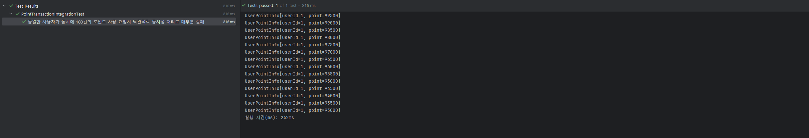
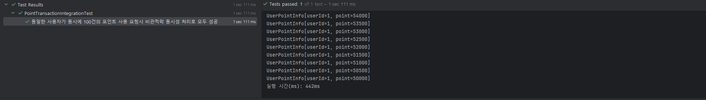

## 😺 동시성 이슈와 제어 방식
> 목차
> - 동시성 제어방식 테스트 및 정리
> - 과제 적용 방식

콘서트 예약 시스템에서 동시성 이슈가 발생할 수 있는 케이스는 다음과 같습니다.

1. 콘서트 좌석 예약: 동시에 여러명의 사용자가 같은 좌석을 예약하려고 시도하는 경우
2. 포인트 충전: 사용자가 동시에 포인트 충전을 진행하는 경우
3. 포인트 사용: 사용자가 동시에 포인트 사용을 진행하는 경우

동시성 이슈를 해결하기 위해 다음과 같이 낙관적락, 비관적락, 분산락을 적용하는 방법을 고려하고, 각 케이스의 특징에 따라 제어 방식을 선택했습니다.

### 📒 동시성 제어방식 테스트 및 정리
#### 1. 낙관적락 (s-lock, 공유락, optimistic lock)
- 특징
    - 읽기 잠금 ( `select ..from.. where ... for share` )으로 한쪽이 커밋 할 때 까지 쓰기 잠금.
    - s-lock을 설정한 트랜잭션은 해당 row를 읽기만 가능하다.
    - 충돌 빈도가 적을 경우 권장되며, 동시 요청 중 한 건만 성공해야하는 케이스에 적합하다.
    - version을 사용하여 충돌을 예방하며, DB Lock 을 설정해 동시성 문제를 제어하는 것이 아니라 읽은 시점과 수정 시점의 데이터 변경 여부를 확인해 제어하는 방식이다.
    - 트랜잭션, Lock 설정 없이 데이터 정합성을 보장할 수 있으므로 비관적 락보다 성능적으로 우위에 있다.
- 장점
    - 충돌이 자주 발생하지 않는 경우 성능이 좋다.
- 단점
    - 충돌이 발생하면 롤백에 대한 처리가 필요하다. 반드시 트랜잭션 커밋 시 버전이 달라 발생하는 예외에 대해 예외처리를 해야한다.
- 구현 복잡도: 낮음

> 🍀 성능, 효율성 테스트 (PointTransactionIntegrationTest.java)
>  - 코드: [PointTransactionIntegrationTest.java](..%2F..%2Fsrc%2Ftest%2Fjava%2Fcom%2Fhhplus%2Fserver%2Fdomain%2Fpayment%2FPointTransactionIntegrationTest.java)
>  - 포인트 사용시 동시성 테스트를 낙관적락을 적용하여 다음과 같은 조건으로 테스트 해보았습니다.
>    - `USER_DEFAULT_AMOUNT = 100000`
>    - `THREAD_COUNT = 100`
>    - `USE_AMOUNT = 500`
>  - 테스트 결과 아래 이미지와 같이 100건 중 14건만 성공하여 100000 포인트 중 93000 포인트가 남은 것을 확인할 수 있었습니다. 총 걸리는 시간은 242ms 였습니다.
>    

#### 2. 비관적락 (x-lock, 베타락, pessimistic lock)
- 특징
    - 쓰기 잠금 ( `select ..from .. where... for update` )으로 특정 자원에 대해 Lock 설정으로 선점해 정합성을 보장하여 하나의 트랜잭션만 읽기/쓰기가 가능하고 다른 트랜잭션은 완료될 때까지 대기한다.
    - 충돌 빈도가 많을 경우 권장되며, 동시 요청에서 순차로 진행될 때 성공할 수 있는 요청이라면 성공시키는 케이스에 적합하다.
- 장점
    - 충돌이 자주 발생할경우 유리하다.
- 단점
    - 대기가 많아질 수 있어 DB 성능 저하와 서로 필요한 자원에 락이 걸려있으므로 데드락이 발생할 수 있다.
- 구현 복잡도: 낮음

> 🍀 성능, 효율성 테스트
>  - 코드: [PointTransactionIntegrationTest.java](..%2F..%2Fsrc%2Ftest%2Fjava%2Fcom%2Fhhplus%2Fserver%2Fdomain%2Fpayment%2FPointTransactionIntegrationTest.java)
>  - 포인트 사용시 동시성 테스트를 비관적락을 적용하여 다음과 같은 조건으로 테스트 해보았습니다. (위의 낙관적락과 동일한 조건입니다.)
>    - `USER_DEFAULT_AMOUNT = 100000`
>    - `THREAD_COUNT = 100`
>    - `USE_AMOUNT = 500`
>  - 테스트 결과 아래 이미지와 같이 100건 중 100건을 모두 성공하여 100000 포인트 중 50000 포인트가 남은 것을 확인할 수 있었습니다. 총 걸리는 시간은 442ms 로 대기를 하며 모두 처리하기 때문에 낙관적락보다 오래 걸린 것을 확인할 수 있었습니다.
>    

#### 3. 분산락 (Redis)
- 특징
    - 분산 시스템에서 일관된 락을 제공하기 위한 것.
    - 트랜잭션 밖에서 락을 적용하며,  DB 부하를 최소화할 수 있다.
- **“레디스”를 활용한 락에서 락 획득과 트랜잭션의 순서의 중요성**
    - 락과 트랜잭션은 데이터의 무결성을 보장하기 위해 아래 순서에 맞게 수행됨을 보장해야 합니다.
        - **락 획득 → 트랜잭션 시작 → 비지니스 로직 수행 → 트랜잭션 종료 → 락 해제**
- 종류
    - simple lock
        - Lock 획득 실패 시 요청에 대한 비즈니스 로직을 수행하지 않는다.
        - 실패 시 재시도 로직에 대해 고려해야하며 요청의 case 에 따라 실패 빈도가 높다.
    - spin lock
        
        - Lock 획득 실패 시, 일정 시간/횟수 동안 지속적인 재시도를 하며 이로 인한 네트워크 비용 발생한다.
        - 재시도에 지속적으로 실패할 시, 스레드 점유 등의 문제가 발생한다.
        - Lettuce 라이브러리 사용
            - setnx, setex 등으로 분산락을 직접 구현해야하고, retry, timeout 기능도 구현해야한다.
            - 재시도를 하기 때문에 레디스에 부하를 줄 수 있다.
    - pub/sub
        
        - 레디스 Pub/Sub 기능을 활용해 락 획득을 실패 했을 시에, “구독” 하고 차례가 될 때까지 이벤트를 기다리는 방식을 이용해 효율적인 Lock 관리가 가능하다.
        - “구독” 한 subscriber 들 중 먼저 선점한 작업만 Lock 해제가 가능하므로 안정적으로 원자적 처리가 가능하다.
        - 직접 구현, 혹은 라이브러리를 이용할 때 해당 방식의 구현이 달라질 수 있으므로 주의해서 사용해야 한다.
        - Redisson 라이브러리 사용
            - subscribe 하는 클라이언트는 락이 해제되었다는 신호를 받고 락 획득을 시도한다.
- 구현 복잡도: 높음

> 🚨 Redisson 라이브러리 사용시 주의점
> - 참고자료
>  - https://redis.io/docs/latest/develop/use/patterns/distributed-locks/
>  - https://martin.kleppmann.com/2016/02/08/how-to-do-distributed-locking.html
> - Redis 공식 문서를 보면 분산락을 위해 RedLock 알고리즘을 사용합니다. RedLock을 Java에서 사용할 수 있도록 구현한 것이 Redisson 라이브러리 입니다.
> - RedLock 알고리즘은 분산 환경에서 다음과 같다고 가정합니다.
>   - 단일 Redis 인스턴스 대신 N개의 독립적인 Redis 마스터를 사용 (일반적으로 N=5)
>   - 과반수(N/2+1) 이상의 Redis 인스턴스에서 락을 획득해야 유효한 것으로 간주
> - Redis 공식 문서에서는 다음과 같은 문제가 발생할 수 있다고 합니다.
>   1. 시스템 클록에 의한 clock drift 현상
>      - Redis는 TTL 만료를 위해 monotonic clock 를 사용하지 않습니다.
>      - 서버의 시간이 갑자기 변경될 경우, 여러 프로세스가 동시에 락을 획득할 수 있습니다.
>   2. 서버 다운, 네트워크 단절, 프로세스 실행 시간 초과시 동시성 문제
>      - 다음과 같은 경우 안전성 보장이 불가능합니다.
>        - Redis 서버가 다운 되었다가 복구 되었을 경우
>        - Redis 서버는 정상이나, 네트워크 문제로 일부 클라이언트와 통신이 끊겨 락을 보유한 클라이언트가 락을 해제하지 못하는 경우
>        - 락을 보유한 프로세스가 TTL보다 오래 실행될 경우
>      - 이를 위한 해결책으로 fencing token 구현이 필요합니다.
>        - 동시성 문제
>            
>        - fencing token 사용시
>            

#### 4. **Kafka Messaging**

- 특징
    - Queue 의 성질을 이용하여 처리 순서를 보장해 특정 데이터에 대한 동시성 문제가 발생하지 않는다.
    - 단, 변경 감지에 대한 부분이 필요하다. (비동기 처리가 되므로 처리 결과를 바로 확인할 수 없음)
    - ex) 주문 내, 상품별 실패시 처리 방법
- 구현 복잡도: 높음

### 📒 과제 적용 방식
콘서트 예약 서비스에서 발생할 수 있는 동시성 문제에 대해 다음과 같이 해결할 수 있다고 판단하였습니다.

#### 1. 콘서트 좌석 예약
- 적절한 방법: 분산락(pub/sub) > 비관적락 > 낙관적락
- 선택한 방법: 분산락(pub/sub) + 낙관적락
- 선택 이유
    - 콘서트 예매는 동시에 접속자가 많기 때문에 충돌이 많이 발생할 수 있어 동시성 이슈가 발생할 가능성이 높습니다.
    - 그리고 여러 서버를 사용할 경우 분산 환경에서 동시성 제어가 필요합니다.
    - 분산 환경에서 동시성 제어와 DB의 부하를 줄이기 위해서는 분산락이 가장 적절하다고 생각이 되었습니다. 그 방식으로는 콘서트 예매 실패 시에 retry를 할 필요가 없으므로 pub/sub 방식이 적절하다고 생각합니다.
    - 그리고 Redisson을 사용하여 구현할 경우, 발생할 수 발생할 수 있는 문제에 대해 콘서트 좌석 예매의 특성상 ‘낙관적락’을 추가로 적용하여 보완할 수 있습니다.
    - 보완 방법으로 비관적락이 아닌 낙관적락을 선택한 이유는 분산락을 사용하기 때문에 충돌이 발생할 가능성이 적고 비관적락보다 낙관적락이 빠르게 처리할 수 있기 때문입니다.
    - Fencing token 대신 낙관적 락을 사용한 이유는 다음과 같습니다.
        - 빠른 처리 시간 : 예약 처리는 비교적 단순하고 빠른 작업입니다. 추가적인 토큰 관리와 오버헤드가 불필요합니다.
        - 충분한 안전성: 분산락으로 1차 방어를 하고 낙관적 락으로 2차 방어를 하는 것으로 충분한 안전성을 확보할 수 있습니다.
        - 실패 처리의 단순함: 예약 실패 시 사용자에게 빠른 피드백이 가능하며 재시도가 발생하더라도 사용자 경험에 크게 영향이 없습니다.
        - 운영 관점의 단순함: 토큰 관리나 추가 인프라 불필요하며 모니터링이 비교적 간단합니다.
    - 추가로 Redis를 사용할 경우 추가적인 인프라를 사용해야 하기 때문에 현재 분산락을 사용하지 않는다면, 비관적 락을 적용하는 것이 적절하다고 생각합니다. 같은 좌석을 예약하는데 동시에 충돌이 많이 발생할 수 있기 때문에 데이터 정합성을 유지할 수 있습니다. 현재 분산 DB를 사용하지 않기 때문에 비관적락으로 충분히 가능하다고 생각이 되었지만, 분산락 적용을 시도해보았습니다.

#### 2. 포인트 충전
- 적절한 방법: 낙관적락 > 비관적락 > 분산락
- 선택한 방법: 낙관적락
- 선택 이유
    - 포인트 충전을 동시에 요청하는 케이스는 거의 없으므로, 충돌이 잘 발생하지 않습니다.
    - 동시 요청에 대해 하나만 성공해도 되며 잘못 된 동시 요청 처리에 대한 문제를 방지할 수 있습니다.
    - 이에 따라 retry를 하거나 트랜잭션이 대기하지 않아도 된다고 생각되었고 동시성이 낮을 경우 성능이 좋은 낙관적락이 적절하다고 판단되었습니다.

#### 3. 포인트 사용
- 적절한 방법: 비관적락 > 분산락 > 낙관적락
- 선택한 방법: 비관적락
- 선택 이유
    - 동시에 여러 콘서트의 좌석을 결제 요청할 수 있는데 이 경우 전부 처리가 되어야 합니다.
    - 안전하게 처리하고 user에 대한 데이터에 접근하는 부하를 줄이기 위해 비관적락이 적절하다고 판단되었습니다

