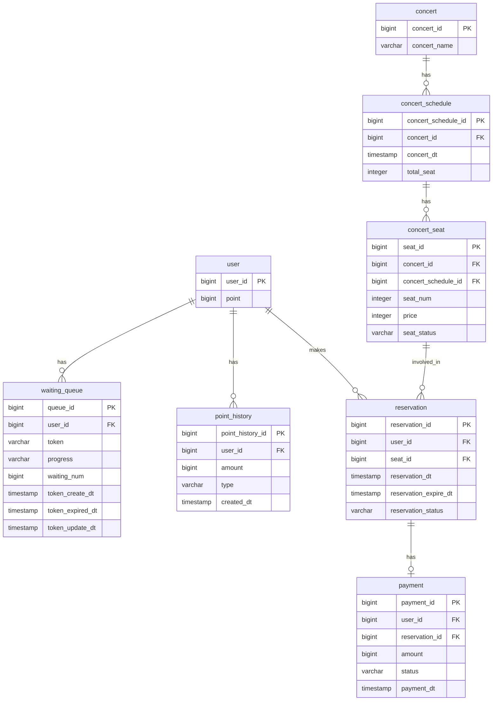

## 😺 콘서트 예약 서비스 ERD

```mermaid
erDiagram
    user {
        bigint user_id PK
        bigint point
    }

    waiting_queue {
        bigint queue_id PK
        bigint user_id FK
        varchar token 
        varchar progress
        bigint waiting_num
        timestamp token_create_dt
        timestamp token_expired_dt
        timestamp token_update_dt
    }

    concert {
        bigint concert_id PK
        varchar concert_name
    }

    concert_schedule {
        bigint concert_schedule_id PK
        bigint concert_id FK
        timestamp concert_dt
        integer total_seat
    }

    concert_seat {
        bigint seat_id PK
        bigint concert_id FK
        bigint concert_schedule_id FK
        integer seat_num
        integer price
        varchar seat_status
    }

    reservation {
        bigint reservation_id PK
        bigint user_id FK
        bigint seat_id FK
        timestamp reservation_dt
        timestamp reservation_expire_dt
        varchar reservation_status
    }
    
    payment {
        bigint payment_id PK
        bigint user_id FK
        bigint reservation_id FK
        bigint amount
        varchar status
        timestamp payment_dt
    }

    point_history {
        bigint point_history_id PK
        bigint user_id FK
        bigint amount
        varchar type
        timestamp created_dt
    }

    user ||--o{ waiting_queue : has
    user ||--o{ point_history : has
    user ||--o{ reservation : makes
    concert ||--o{ concert_schedule : has
    concert_schedule ||--o{ concert_seat : has
    concert_seat ||--o{ reservation : involved_in
    reservation ||--o| payment : has
```