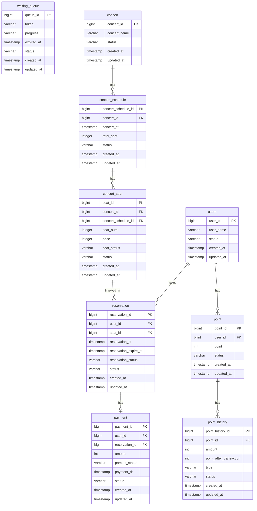

## 😺 콘서트 예약 서비스 ERD
* waiting_queue: redis를 사용하도록 변경

```mermaid
erDiagram
    users {
        bigint user_id PK
        varchar user_name
        varchar status
        timestamp created_at
        timestamp updated_at
    }

    waiting_queue {
        bigint queue_id PK
        varchar token
        varchar progress
        timestamp expired_at
        varchar status
        timestamp created_at
        timestamp updated_at
    }

    concert {
        bigint concert_id PK
        varchar concert_name
        varchar status
        timestamp created_at
        timestamp updated_at
    }

    concert_schedule {
        bigint concert_schedule_id PK
        bigint concert_id FK
        timestamp concert_dt
        integer total_seat
        varchar status
        timestamp created_at
        timestamp updated_at
    }

    concert_seat {
        bigint seat_id PK
        bigint concert_id FK
        bigint concert_schedule_id FK
        integer seat_num
        integer price
        varchar seat_status
        varchar status
        timestamp created_at
        timestamp updated_at
    }

    reservation {
        bigint reservation_id PK
        bigint user_id FK
        bigint seat_id FK
        timestamp reservation_dt
        timestamp reservation_expire_dt
        varchar reservation_status
        varchar status
        timestamp created_at
        timestamp updated_at
    }

    payment {
        bigint payment_id PK
        bigint user_id FK
        bigint reservation_id FK
        int amount
        varchar pament_status
        timestamp payment_dt
        varchar status
        timestamp created_at
        timestamp updated_at
    }
    
    point {
        bigint point_id PK
        bitint user_id FK
        int point
        varchar status
        timestamp created_at
        timestamp updated_at
    }

    point_history {
        bigint point_history_id PK
        bigint point_id FK
        int amount
        int point_after_transaction
        varchar type
        varchar status
        timestamp created_at
        timestamp updated_at
    }

    users ||--o{ point : has
    point ||--o{ point_history : has
    concert_seat ||--o{ reservation : involved_in
    concert ||--o{ concert_schedule : has
    users ||--o{ reservation : makes
    concert_schedule ||--o{ concert_seat : has
    reservation ||--o| payment : has
```