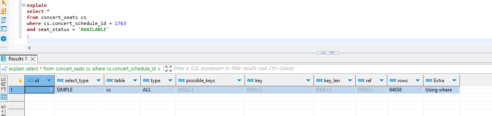
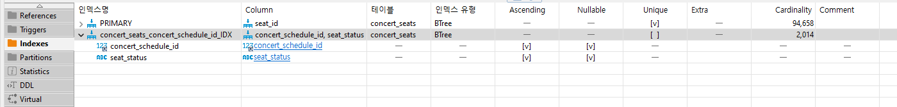

## 😺 DB Index 설정 및 쿼리 성능 개선
> 목차
> - Index 설정
> - 성능 개선 테스트 결과

### 📒 Index 설정
MySQL에서 PK는 클러스터 인덱스(Clustered Index)로 PK는 따로 인덱스를 지정하지 않아도 인덱스 설정이 됩니다. 
(참고: https://dev.mysql.com/doc/refman/8.0/en/innodb-index-types.html)
따라서 사용된 쿼리를 확인한 결과 다음 쿼리들에서 인덱스 설정을 통해 성능을 향상시킬 수 있을 것으로 보았습니다. 

1. 콘서트 예약 가능한 좌석 조회
   - 콘서트 예약 가능한 좌석 조회시 `concert_schedule_id`, `seat_status` 를 통해 좌석 리스트를 조회하는 쿼리
   - ConcertSeatJpaRepository.java
      ```java
      List<ConcertSeat> findByConcertScheduleAndSeatStatus(ConcertSchedule concertSchedule, SeatStatus seatStatus);
      ```
   - Index 설정
      ```mysql
      CREATE INDEX concert_seats_concert_schedule_id_IDX ON concert_seats(concert_schedule_id, seat_status);
      ```

<br> 

2. 임시 예약 만료를 위해 만료 시간 지난 임시 예약 조회
   - 예약 만료 시간이 지난 `임시 예약` 상태의 예약건 조회시 `reservation_status`, `reservation_expire_dt` 를 통해 조회하는 쿼리
   - ReservationJpaRepository.java
     ```java
     @Query("SELECT rv FROM Reservation rv WHERE rv.reservationStatus = 'TEMPORARY' AND current_timestamp > rv.reservationExpireDt")
     List<Reservation> findReservationsTemporaryToExpired();
     ```
   - Index 설정
     ```mysql
     CREATE INDEX reservation_reservation_status_IDX ON reservation(reservation_status, reservation_expire_dt);
     ```
<br> 

3. 물리적으로 FK 설정하지 않은 논리적인 FK

<br> 

### 📒 성능 개선 테스트 결과
위의 케이스 중 `콘서트 예약 가능한 좌석 조회`하는 쿼리로 인덱스 적용 전후 비교 테스트를 진행해보았습니다.
Index 설정 전후 비교를 위해 ApplicationRunner를 사용하여 1000건의 콘서트, 2000건의 콘서트 스케줄, 10만건의 콘서트 좌석 더미 데이터를 생성하고 Explain을 통해 확인해보았습니다. 

1. Index 설정 전 Explain 결과
   - Index 설정하기 전 다음과 같이 `type`이 `ALL`로 확인되었습니다.
     
   
<br> 

2. Index 설정 후 Explain 결과
   - 다음과 같이 Index 설정을 하였습니다.
     
   - Index 설정 후 다음과 같이 `type`이 `ref`로 변경된 것을 확인하였습니다.
     

<br> 

3. (참고) 테스트 데이터
   - concert <br>
       
   - concert_schedule <br>
       
   - concert_seats <br>
     
