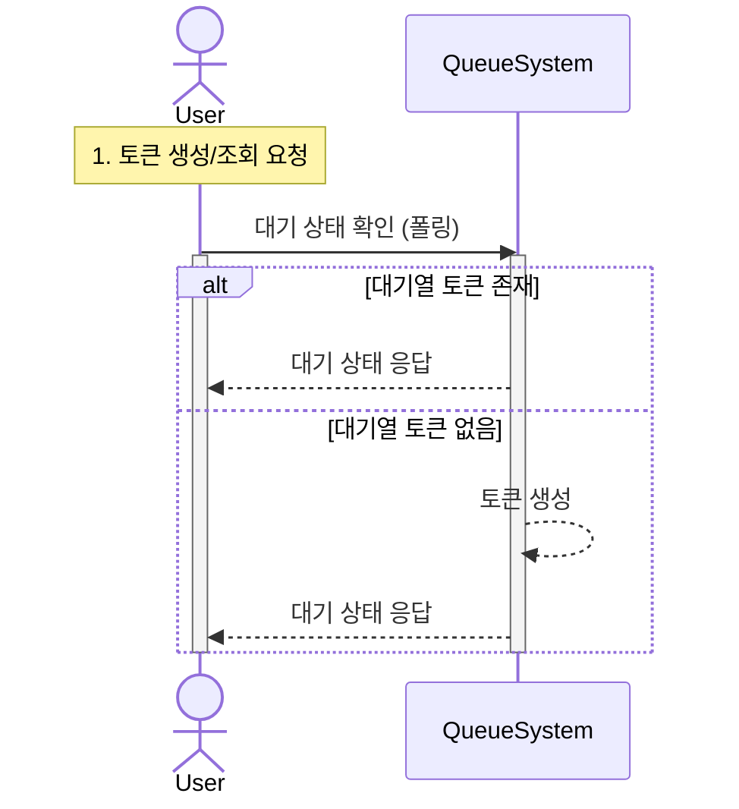
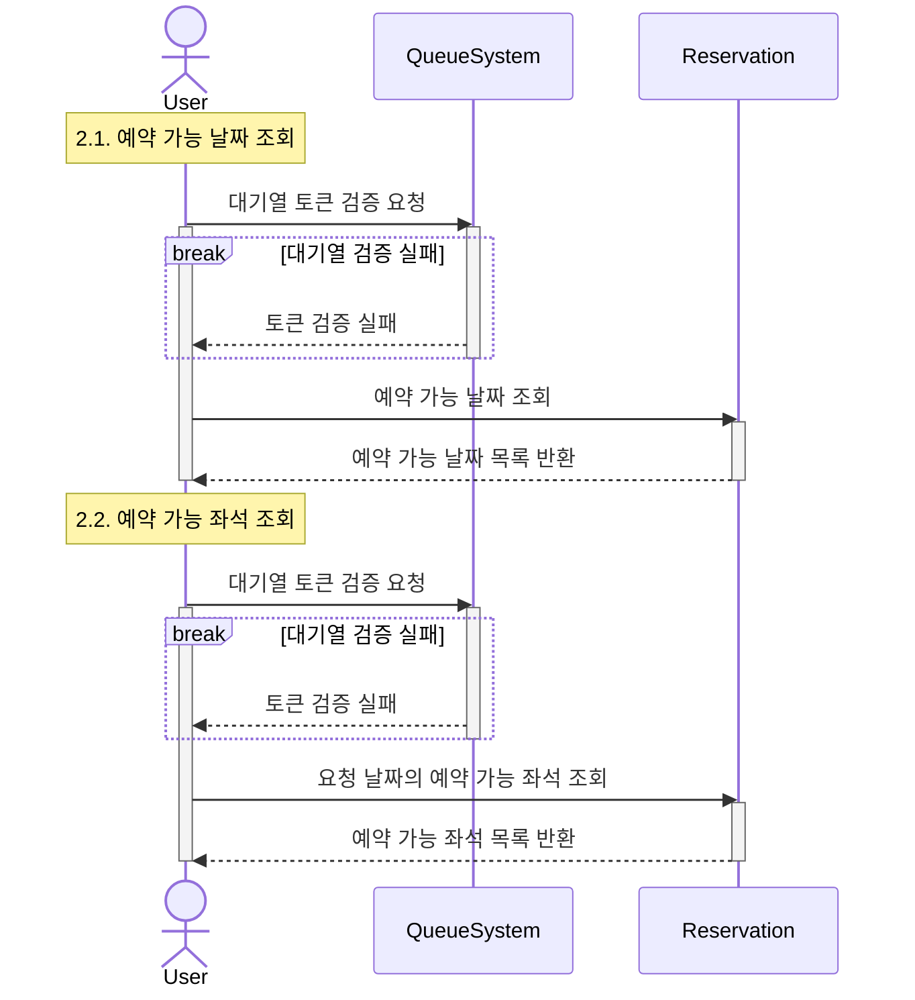
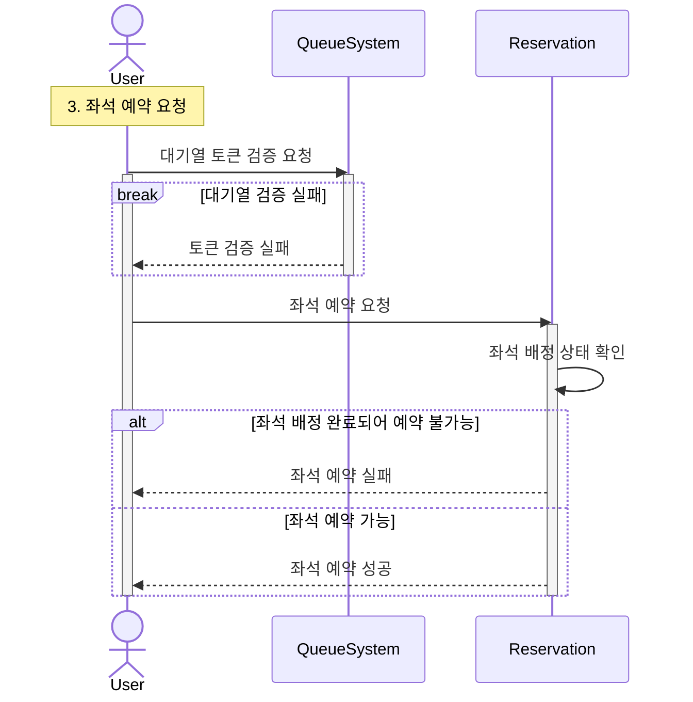
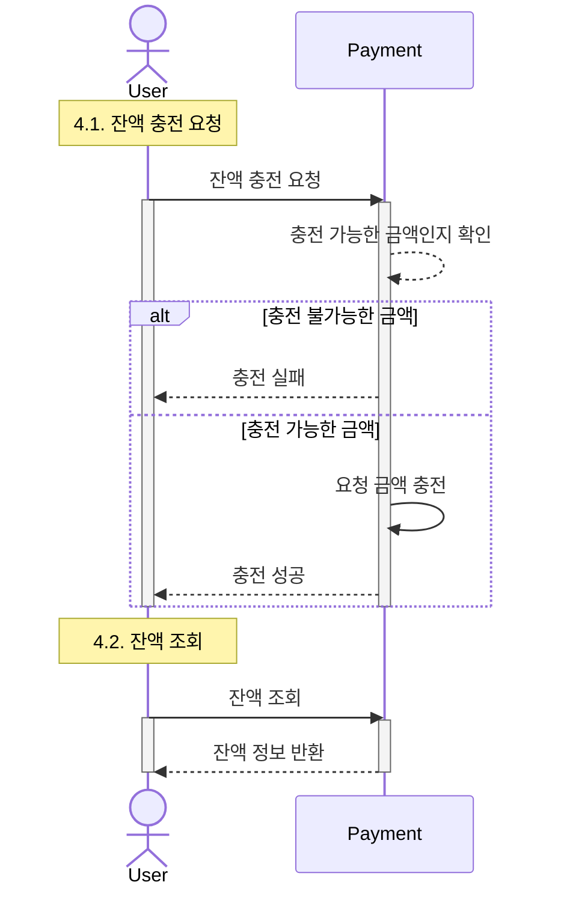
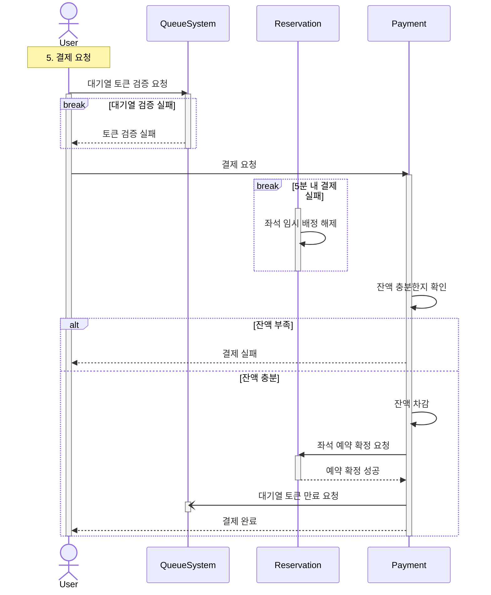

## 😺 콘서트 예약 서비스 Sequence Diagram
### 1. 토큰 생성/조회 요청

```mermaid
sequenceDiagram
    actor User
    participant QueueSystem
    
    note over User: 1. 토큰 생성/조회 요청
    User->>QueueSystem: 대기 상태 확인 (폴링)
    activate User
    activate QueueSystem
    alt 대기열 토큰 존재
        QueueSystem-->>User: 대기 상태 응답
    else 대기열 토큰 없음
        QueueSystem-->>QueueSystem: 토큰 생성
        QueueSystem-->>User: 대기 상태 응답
    end
    deactivate QueueSystem
    deactivate User
```

### 2. 예약 가능 날짜/좌석 조회

```mermaid
sequenceDiagram
    actor User
    participant QueueSystem
    participant Reservation
    
    note over User: 2.1. 예약 가능 날짜 조회
    User->>QueueSystem: 대기열 토큰 검증 요청
    activate User
    activate QueueSystem
    break 대기열 검증 실패
        QueueSystem-->>User: 토큰 검증 실패
    end
    deactivate QueueSystem
    User->>Reservation: 예약 가능 날짜 조회
    activate Reservation
    Reservation-->>User: 예약 가능 날짜 목록 반환
    deactivate Reservation
    deactivate User

    note over User: 2.2. 예약 가능 좌석 조회
    User->>QueueSystem: 대기열 토큰 검증 요청
    activate User
    activate QueueSystem
    break 대기열 검증 실패
        QueueSystem-->>User: 토큰 검증 실패
    end
    deactivate QueueSystem
    User->>Reservation: 요청 날짜의 예약 가능 좌석 조회
    activate Reservation
    Reservation-->>User: 예약 가능 좌석 목록 반환
    deactivate Reservation
    deactivate User
```

### 3. 좌석 예약 요청

```mermaid
sequenceDiagram
    actor User
    participant QueueSystem
    participant Reservation
    
    note over User: 3. 좌석 예약 요청
    User->>QueueSystem: 대기열 토큰 검증 요청
    activate User
    activate QueueSystem
    break 대기열 검증 실패
        QueueSystem-->>User: 토큰 검증 실패
    end
    deactivate QueueSystem

    User->>Reservation: 좌석 예약 요청
    activate Reservation
    Reservation->>Reservation: 좌석 배정 상태 확인
    alt 좌석 배정 완료되어 예약 불가능
        Reservation-->>User: 좌석 예약 실패
    else 좌석 예약 가능
        Reservation-->>User: 좌석 예약 성공
    end
    deactivate Reservation
    deactivate User
```

### 4. 포인트 충전/조회

```mermaid
sequenceDiagram
    actor User
    participant Payment
    note over User: 4.1. 잔액 충전 요청
    
    User->>Payment: 잔액 충전 요청
    activate User
    activate Payment
    Payment-->>Payment: 충전 가능한 금액인지 확인
    alt 충전 불가능한 금액
        Payment-->>User: 충전 실패
    else 충전 가능한 금액
        Payment->>Payment: 요청 금액 충전
        Payment-->>User: 충전 성공
    end
    deactivate Payment
    deactivate User

    note over User: 4.2. 잔액 조회
    User->>Payment: 잔액 조회
    activate User
    activate Payment
    Payment-->>User: 잔액 정보 반환
    deactivate Payment
    deactivate User
```

### 5. 결제 요청

```mermaid
sequenceDiagram
    actor User
    participant QueueSystem
    participant Reservation
    participant Payment
    note over User: 5. 결제 요청
    User->>QueueSystem: 대기열 토큰 검증 요청
    activate User
    activate QueueSystem
    break 대기열 검증 실패
        QueueSystem-->>User: 토큰 검증 실패
    end
    deactivate QueueSystem

    User->>Payment: 결제 요청
    activate Payment
    break 5분 내 결제 실패
        activate Reservation
        Reservation->>Reservation: 좌석 임시 배정 해제
    end
    deactivate Reservation

    Payment->>Payment: 잔액 충분한지 확인
    alt 잔액 부족
        Payment-->>User: 결제 실패
    else 잔액 충분
        Payment->>Payment: 잔액 차감
        Payment->>Reservation: 좌석 예약 확정 요청
        activate Reservation
        Reservation-->>Payment: 예약 확정 성공
        deactivate Reservation
        Payment-)QueueSystem: 대기열 토큰 만료 요청
        activate QueueSystem
        deactivate QueueSystem
        Payment-->>User: 결제 완료
    end
    deactivate Payment
    deactivate User
```
